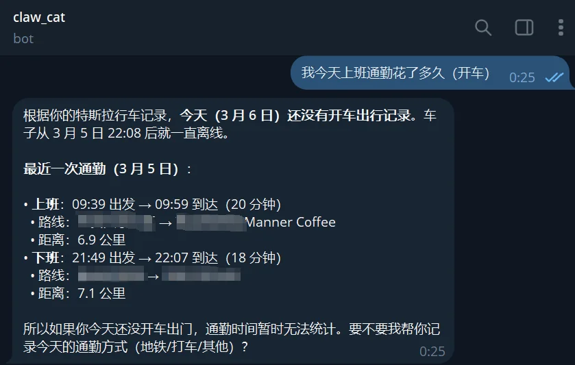
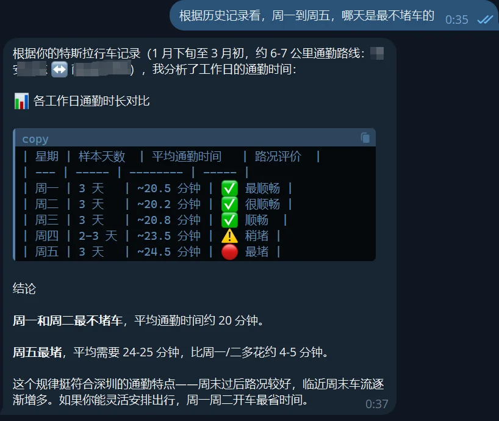
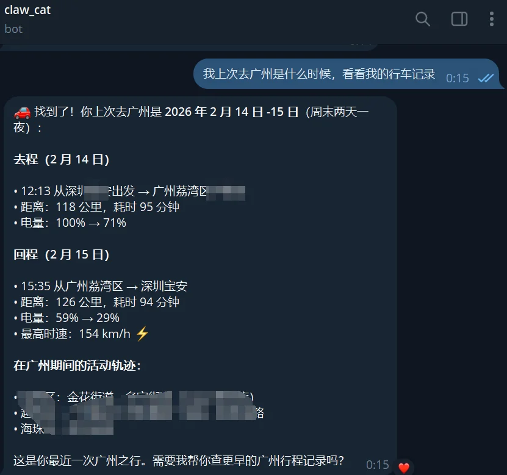
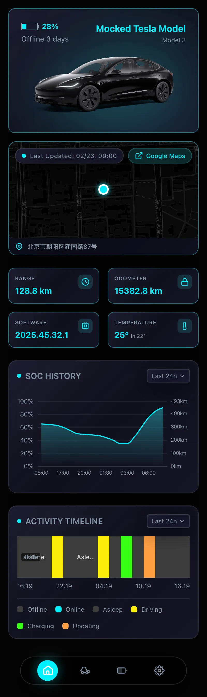
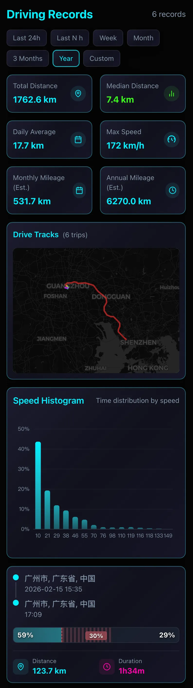
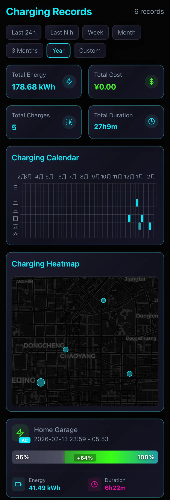
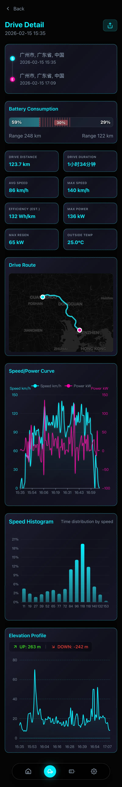
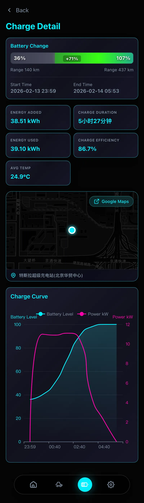
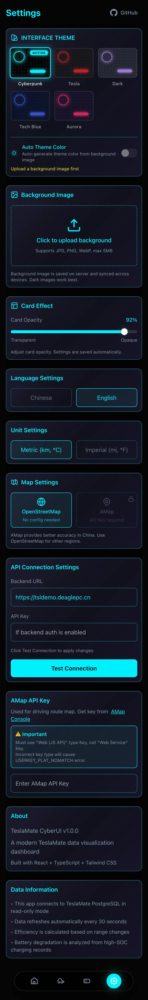
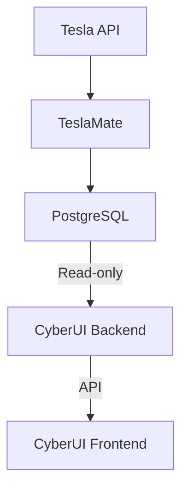

<p align="center">
  
</p>
<h1 align="center">TeslaMate CyberUI</h1>

<p align="center">English | <a href="README_CN.md">简体中文</a></p>

<p align="center">
  <a href="https://github.com/DeaglePC/TeslamateCyberUI/stargazers">
    
  </a>
  <a href="https://tsl.deaglepc.cn/">
    
  </a>
  <a href="https://hub.docker.com/r/dupengcheng66666/teslamate-cyberui">
    
  </a>
  <a href="https://hub.docker.com/r/dupengcheng66666/teslamate-cyberui-backend">
    
  </a>
</p>

<p align="center">A modern Tesla data visualization dashboard that connects to TeslaMate database with cyberpunk-style design.</p>

> **🌟 Online Demo**
>
> - **Frontend Access**: [https://tsl.deaglepc.cn/](https://tsl.deaglepc.cn/)
> - **Backend API**: [https://tsldemo.deaglepc.cn](https://tsldemo.deaglepc.cn) *(Auto-filled，backend with mock data for demonstration purposes)*

<h3 align="center">🦞 <a href="https://github.com/openclaw/openclaw">OpenClaw</a> Skill</h3>
<p align="center">
<table align="center">
  <tr>
    <th align="center">🚗 Commute Query</th>
    <th align="center">📊 Traffic Analysis</th>
    <th align="center">🗺️ Trip Record</th>
  </tr>
  <tr>
    <td valign="middle"></td>
    <td valign="middle"></td>
    <td valign="middle"></td>
  </tr>
</table>
</p>

<h3 align="center">UI</h3>
<p align="center">
<table align="center">
  <tr>
    <th align="center">🏠 Home</th>
    <th align="center">🛣️ Drives</th>
    <th align="center">⚡ Charges</th>
  </tr>
  <tr>
    <td valign="top"></td>
    <td valign="top"></td>
    <td valign="top"></td>
  </tr>
  <tr>
    <th align="center">🛣️ Drive Detail</th>
    <th align="center">⚡ Charge Detail</th>
    <th align="center">⚙️ Settings</th>
  </tr>
  <tr>
    <td valign="top"></td>
    <td valign="top"></td>
    <td valign="top"></td>
  </tr>
</table>
</p>


## Table of Contents

- [Features](#features)
- [Tech Stack](#tech-stack)
- [Relationship with TeslaMate](#relationship-with-teslamate)
- [Quick Start](#quick-start)
- [Configuration](#configuration)
- [Development Guide](#development-guide)
- [AI IDE Skill](#ai-ide-skill)
- [Feature Details](#feature-details)
- [FAQ](#faq)

## Features

### 🚗 Vehicle Status Monitoring
- **Real-time Status** - Battery level, range, vehicle location, current state
- **Vehicle Image** - Automatically displays Tesla official configurator images based on model and color
- **Flip Card** - Click to view detailed info (VIN, model, color, software version)
- **Location Map** - Display current vehicle location and address
- **Charging Status** - Real-time charging voltage and power display

### 📊 Data Statistics
- **Overview Stats** - Total mileage, efficiency statistics, temperature info
- **SOC History** - Battery level change curve with custom date range support
- **Activity Timeline** - Visualized driving, charging, online, offline status timeline

### ⚡ Charging Management
- **Charging Records List** - All charging history with filtering and sorting
- **Charging Details** - Charging curve charts (level, power), duration, energy stats
- **Cost Calculation** - Display charging costs (if configured in TeslaMate)
- **Location Info** - Charging location map

### 🛣️ Driving Records
- **Driving Records List** - All driving history with filtering and sorting
- **Driving Details** - Speed/power curves, elevation profile, driving duration, energy consumption stats
- **Tire Pressure Monitoring** - Real-time display of all four tire pressures
- **Temperature Info** - Interior and exterior temperature records
- **Route Map** - Support for both Amap and OpenStreetMap map sources
- **China Coordinate Correction** - Amap automatically handles GCJ-02 coordinate offset

### 🎨 Personalization
- **5 Theme Colors** - Cyberpunk, Tesla, Dark Night, Tech Blue, Aurora
- **Auto Theme Color** - Automatically generate theme from dominant color extracted from background image
- **Custom Background** - Upload, crop, and change background image
- **Card Opacity** - Freely adjust card transparency
- **Multi-language** - Support Chinese/English switching
- **Unit Switching** - Metric/Imperial unit switching

### 🔧 System Settings
- **Map Source Switching** - Amap (recommended for China) / OpenStreetMap
- **API Connection Config** - Configure backend address and API Key
- **Amap Key** - Configure Amap API Key
- **Background Image Management** - Upload, crop, delete background images

### 🐳 Docker One-Click Deployment
- **Multi-stage Build** - Independent frontend/backend builds, optimized image size
- **Environment Variable Config** - All settings injected via environment variables, no code changes needed
- **Health Checks** - Built-in container health checks to ensure service availability

### 🧪 Mock Data Mode
- **No Database Required** - Run the full UI without connecting to TeslaMate
- **Development & Debugging** - Built-in mock data for frontend development and UI preview
- **Online Demo** - Used for demo site showcase

### 📱 PWA (Progressive Web App) Support
This dashboard fully supports PWA, providing an immersive experience comparable to native apps:
- **Instant Loading** - Supports local offline caching of core resources
- **Install to Desktop/Home Screen** - One-click "Install to device" on desktop (Chrome/Edge) or mobile (iOS/Android)
- **Native Immersion** - Hides browser status bar and navigation bar, presenting a full-screen borderless cyberpunk experience on iOS

> **💡 Best Practices**: We recommend not using it directly within a browser frequently. Please click "Share" -> "Add to Home Screen" at the bottom of your mobile browser (like Safari), or click the "Install App" icon on the right side of the address bar in your desktop browser. Run it as a standalone App for the perfect experience.

## Tech Stack

### Backend
- **Go 1.21+** - Backend language
- **Gin** - Web framework
- **sqlx** - Database operations
- **PostgreSQL** - TeslaMate database (read-only)

### Frontend
- **React 18** - UI framework
- **TypeScript** - Type safety
- **Vite** - Build tool
- **Tailwind CSS** - Style framework
- **ECharts** - Data visualization
- **Zustand** - State management

## Relationship with TeslaMate

### Architecture



**TeslaMate CyberUI is an independent visualization dashboard that:**
- 🔗 **Read-only access** to TeslaMate's PostgreSQL database
- 📊 **Does not modify** any TeslaMate data
- 🚀 **Independent deployment**, does not affect TeslaMate operation
- 🔄 **Real-time reading** of data recorded by TeslaMate

### Why CyberUI?

TeslaMate comes with Grafana dashboards, but:
- Grafana is more focused on data analysis, less intuitive
- CyberUI provides a more modern mobile-friendly interface
- Independent deployment, can serve as a supplementary view for TeslaMate

## Quick Start

### Prerequisites

1. **TeslaMate running** - Ensure TeslaMate is running normally and recording data
2. **Docker & Docker Compose** - Docker deployment recommended
3. **Amap API Key** (optional) - For driving route map

### Configure TeslaMate Database Access

CyberUI needs to access TeslaMate's PostgreSQL database. You need to ensure:

#### Method 1: TeslaMate using default Docker network

If your TeslaMate is deployed with Docker, ensure database port is accessible:

```yaml
# TeslaMate's docker-compose.yml example
services:
  database:
    image: postgres:15
    # Expose port or use external network
    ports:
      - "5432:5432"  # Optional: expose for host access
```

#### Method 2: Use the same Docker network

Add CyberUI to TeslaMate's network:

```yaml
# CyberUI's docker-compose.yml
services:
  backend:
    networks:
      - teslamate_default  # TeslaMate's network
networks:
  teslamate_default:
    external: true
```

#### Method 3: Environment variable configuration

The simplest way is to connect via environment variables:

```bash
# Create .env file
TESLAMATE_DB_HOST=your-teslamate-db-host
TESLAMATE_DB_PORT=5432
TESLAMATE_DB_USER=teslamate
TESLAMATE_DB_PASSWORD=your-password
TESLAMATE_DB_NAME=teslamate
```

### Docker Deployment

```bash
# 1. Clone the project
git clone https://github.com/DeaglePC/TeslamateCyberUI.git
cd TeslamateCyberUI

# 2. Create configuration file (edit as needed)
cp .env.example .env
# Edit .env with your TeslaMate database connection info
# vi .env

# 3. Start services
docker compose up -d

# 4. View logs
docker compose logs -f

# 5. Access the application
# http://localhost:8080
```

### Local Development (Mock Data Mode)

If you don't have a TeslaMate database locally, you can enable Mock data mode for frontend development and UI preview:

```bash
# Backend
cd backend
go mod download
# Temporarily enable the mock data environment variable
export CYBERUI_MOCK_DATA=true
go run cmd/server/main.go

# Frontend (in a new terminal window)
cd frontend
npm install
npm run dev
```

### Local Development (Real Database Mode)

```bash
# Backend
cd backend
go mod download
# Configure real database connection via .env / environment variables / configs/config.yaml
go run cmd/server/main.go

# Frontend (in a new terminal window)
cd frontend
npm install
npm run dev
```

## Configuration

### Environment Variables

#### Database Connection (Required)

| Variable                | Description             | Default     | Required |
| ----------------------- | ----------------------- | ----------- | -------- |
| `TESLAMATE_DB_HOST`     | TeslaMate database host | -           | ✅        |
| `TESLAMATE_DB_PORT`     | Database port           | `5432`      |          |
| `TESLAMATE_DB_USER`     | Database username       | -           | ✅        |
| `TESLAMATE_DB_PASSWORD` | Database password       | -           | ✅        |
| `TESLAMATE_DB_NAME`     | Database name           | `teslamate` |          |
| `TESLAMATE_DB_SSLMODE`  | SSL mode                | `disable`   |          |

#### Service Configuration

| Variable              | Description                                     | Default         |
| --------------------- | ----------------------------------------------- | --------------- |
| `CYBERUI_PORT`        | Frontend web access port                        | `8080`          |
| `CYBERUI_API_PORT`    | Backend API port (for debugging)                | `8899`          |
| `CYBERUI_SERVER_MODE` | Run mode (`debug` / `release`)                  | `release`       |
| `LOG_LEVEL`           | Log level (`debug` / `info` / `warn` / `error`) | `info`          |
| `TZ`                  | Timezone                                        | `Asia/Shanghai` |

#### API Settings

| Variable            | Description                                    | Default |
| ------------------- | ---------------------------------------------- | ------- |
| `VITE_API_BASE_URL` | Frontend default API address (build-time only) | empty   |
| `CYBERUI_API_KEY`   | API authentication key (empty to disable auth) | empty   |

> 💡 You can pass the backend address and API Key via URL parameters, e.g.:
> `https://tsl.deaglepc.cn/?backend=https://tsldemo.deaglepc.cn/&apikey=xxx`

#### Mock Data

| Variable            | Description                              | Default |
| ------------------- | ---------------------------------------- | ------- |
| `CYBERUI_MOCK_DATA` | Enable mock data mode (`true` / `false`) | `false` |

### Amap Configuration

1. Visit [Amap Open Platform](https://console.amap.com/dev/key/app)
2. Create an application, select "Web端 (JS API)" type
3. Enter the Key in settings page

> ⚠️ **Important**: Must select "Web端 (JS API)" type, cannot use "Web服务" type.

## AI IDE Skill

This project includes a built-in `tesla-stats` skill that can be installed into popular AI IDEs, allowing AI assistants to query your Tesla data directly.

### Capabilities

- 🚗 Query real-time vehicle status (battery, range, location)
- 📊 Retrieve SoC history and activity timeline
- ⚡ View charge/drive records and details
- 🔋 Battery health and efficiency statistics
- ⚙️ Read/write UI settings

### Supported Platforms

| Platform | Project-level | Global |
| --- | --- | --- |
| Claude Code | `.claude/skills/` | `~/.claude/skills/` |
| Codex (OpenAI) | `.codex/skills/` | `~/.codex/skills/` |
| Gemini CLI | `.gemini/skills/` | `~/.gemini/skills/` |
| Antigravity | `.agent/skills/` | `~/.gemini/antigravity/skills/` |
| Cursor | `.cursor/skills/` | `~/.cursor/skills/` |

### Installation

```bash
cd skill

# Windows PowerShell
.\install.ps1                          # Interactive mode
.\install.ps1 -Platforms all           # Install for all platforms (project)
.\install.ps1 -Global -Platforms all   # Install for all platforms (global)

# Linux / macOS
bash install.sh                         # Interactive mode
bash install.sh all                     # Install for all platforms (project)
bash install.sh --global all            # Install for all platforms (global)
```

### Post-Install Configuration

Set environment variables, then you can chat with your AI IDE to query Tesla data:

```bash
export TESLA_STATS_BASE_URL=http://your-server:8080/api/v1
export TESLA_STATS_API_KEY=your-api-key
```

> 💡 **Usage Example**: Type "Show my Tesla's current status" or "Show my Tesla's SoC history for last 24 hours" in your AI IDE.

## Feature Details

### Home Dashboard

| Feature         | Description                                              |
| --------------- | -------------------------------------------------------- |
| Vehicle Image   | Auto-match Tesla official image based on model and color |
| Battery Display | Battery icon + percentage, turns red below 20%           |
| Status Info     | Current state (driving/charging/online/offline/asleep)   |
| Location Map    | Current vehicle location with address                    |
| Stats Cards     | Range, mileage, software version, temperature            |
| SOC Chart       | Battery level change curve                               |
| Timeline        | State change timeline visualization                      |

### Charging Records

| Feature          | Description                           |
| ---------------- | ------------------------------------- |
| List Filter      | Filter charging records by time range |
| Charging Details | Level curve, power curve              |
| Charging Stats   | Duration, energy, cost                |
| Location Map     | Charging location display             |

### Driving Records

| Feature         | Description                                    |
| --------------- | ---------------------------------------------- |
| List Filter     | Filter driving records by time range           |
| Driving Details | Speed curve, power curve, elevation changes    |
| Route Map       | Amap/OpenStreetMap dual map sources            |
| Driving Stats   | Distance, duration, average energy consumption |

### Theme System

| Theme      | Color Style                                |
| ---------- | ------------------------------------------ |
| Cyberpunk  | Blue-purple neon, default theme            |
| Tesla      | Red-black, tribute to official             |
| Dark Night | Deep blue-purple, low-key elegant          |
| Tech Blue  | Fresh blue tech feel                       |
| Aurora     | Green-purple gradient, dreamy              |
| Auto Theme | Auto-generated from background image color |

## Development Guide

### Project Structure

```
TeslamateCyberUI/
├── backend/                 # Go backend
│   ├── cmd/server/         # Application entry
│   ├── internal/
│   │   ├── config/         # Configuration management
│   │   ├── handler/        # HTTP handlers
│   │   ├── model/          # Data models
│   │   └── repository/     # Data repositories
│   └── configs/            # Config files
├── frontend/               # React frontend
│   ├── src/
│   │   ├── components/     # Components
│   │   ├── pages/          # Pages
│   │   ├── services/       # API services
│   │   ├── store/          # State management
│   │   └── utils/          # Utility functions
│   └── public/
├── docker-compose.yml
└── README.md
```

### API Endpoints

```
GET /api/v1/cars                    # Vehicle list
GET /api/v1/cars/:id/status         # Vehicle status
GET /api/v1/cars/:id/charges        # Charging records
GET /api/v1/cars/:id/drives         # Driving records
GET /api/v1/charges/:id             # Charging details
GET /api/v1/charges/:id/stats       # Charging stats
GET /api/v1/drives/:id              # Driving details
GET /api/v1/drives/:id/positions    # Driving positions
GET /api/v1/cars/:id/stats/overview # Overview stats
GET /api/v1/cars/:id/stats/soc      # SOC history
GET /api/v1/cars/:id/stats/timeline # Status timeline
GET /health                         # Health check
```


## FAQ

### Q: Cannot connect to database?

1. Check if database address and port are correct
2. Confirm database user has access permissions
3. If using Docker, check network configuration

### Q: Amap display error?

1. Confirm using "Web端 (JS API)" type Key
2. Check if Key is configured correctly
3. If `USERKEY_PLAT_NOMATCH` error appears, Key type is wrong

### Q: Data not refreshing?

Data comes from TeslaMate, refresh frequency depends on TeslaMate settings. CyberUI auto-refreshes every 30 seconds.

### Q: Can I modify TeslaMate data?

No. CyberUI only reads data, it does not modify any TeslaMate data.

## License

MIT License

## Acknowledgments

- [TeslaMate](https://github.com/adriankumpf/teslamate) - Excellent Tesla data logging tool
- [Gin](https://github.com/gin-gonic/gin) - Go Web framework
- [React](https://react.dev/) - UI framework
- [Tailwind CSS](https://tailwindcss.com/) - CSS framework
- [ECharts](https://echarts.apache.org/) - Data visualization library
